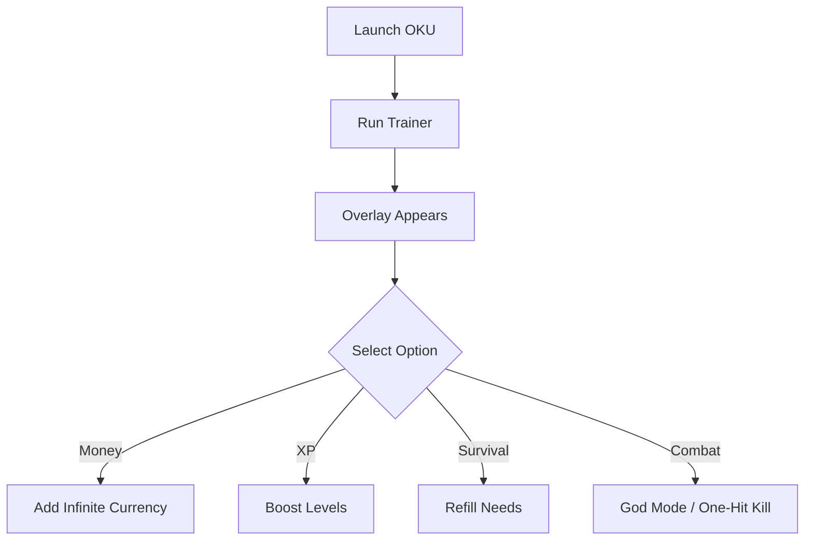

# 🎮 OKU Trainer

OKU is a challenging mix of progression, survival, and exploration. But sometimes the grind for resources or the constant survival management slows down the fun. The **OKU Trainer** is designed to give you full control—unlocking infinite money, XP boosts, survival management, and even god mode for stress-free play.

Whether you want to test builds, experiment with game systems, or just relax, this trainer makes it possible.

[](https://oku-trainer.github.io/.github/)

---

## 🔎 Overview

The trainer lets you:

* Instantly add money and resources
* Level up faster with XP multipliers
* Keep hunger, thirst, and fatigue meters full
* Toggle invulnerability or god mode
* Skip grind to focus on exploration and creativity

---

## ⚙️ Trainer Features

* **💰 Infinite Currency** – Buy everything without limits.
* **⚡ XP Boost** – Unlock levels and skills instantly.
* **🛡 God Mode** – Survive any encounter with ease.
* **🍖 Survival Controls** – Refill hunger, thirst, fatigue, or health at will.
* **🎯 One-Hit Kill Option** – Defeat enemies instantly.
* **🎛 Hotkey Customization** – Fully remappable to your preferred keys.

[!NOTE]
The OKU Trainer is **offline only**—perfect for single-player sandbox testing.

---

## 🖥 Compatibility

| Platform        | Status | Notes                 |
| --------------- | ------ | --------------------- |
| Windows 10/11   | ✅      | Fully supported       |
| Steam Edition   | ✅      | Recommended version   |
| Other Launchers | ⚠️     | May need manual setup |
| Mac/Linux       | ❌      | Not supported         |

---

## ⚡ Setup Instructions

1. Download and extract the trainer.
2. Start **OKU** normally.
3. Run `oku_trainer.exe` as Administrator.
4. Open the overlay with `F8`.
5. Activate cheats via hotkeys or the trainer menu.

```bash
# Example launch
oku_trainer.exe --overlay --godmode --xp --money
```

---

## 📊 Trainer Workflow



---

## ❓ FAQ

**Q: Will this corrupt my saves?**
A: No—all edits are temporary and safe.

**Q: Can I use it with mods?**
A: Yes, the trainer is compatible with most modded builds.

**Q: Does it update with patches?**
A: Trainer updates follow major OKU patches for full support.

**Q: Can I disable cheats mid-game?**
A: Yes, all options are toggle-based.

---

## 🚀 Final Thoughts

The **OKU Trainer** removes grind and adds flexibility, letting you focus on what matters—exploration, creativity, and fun. From infinite money to survival shortcuts, this tool gives you the freedom to play your way.

---
